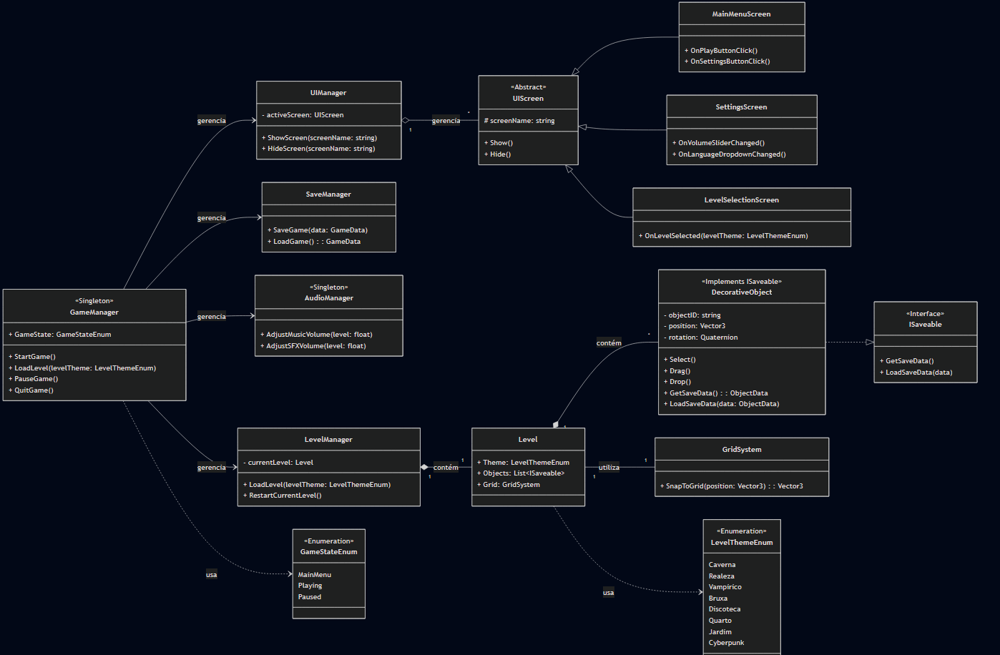

<h3 align="center">projeto.integrador.ii</h3>

 Repositório dedicado ao desenvolvimento de um jogo eletrônico completo, do conceito ao lançamento 

  
  
  

## Sobre o Projeto: O Jogo "Dekora"

### Objetivo

O objetivo é desenvolver um jogo eletrônico completo e polido, desde sua concepção inicial de design até uma versão final pronta para ser lançada em plataformas digitais.

### Contexto e Público-Alvo

"Dekora" é um **jogo de relaxamento (cozy game)**, inspirada em _Unpacking_. O foco é proporcionar uma experiência tranquila e satisfatória, onde o jogador organiza e decora espaços.

O **público-alvo** são jogadores que buscam uma jogabilidade meditativa, focada na expressão criativa e na organização, sem pressão de tempo ou mecânicas de falha.

O projeto abrange todas as fases do desenvolvimento, incluindo:

- Game Design e Lógica de Jogo.
- Programação de Lógica, Ferramentas e Interface (UI/UX).
- Criação de arte visual, modelos 3D e design de áudio.
- Testes de qualidade e validação.

## Por que este projeto é importante?

Este projeto representa a ponte entre o conhecimento acadêmico e a experiência prática do mercado. Nossa motivação é criar um produto real e tangível, superando os requisitos da disciplina para construir um portfólio poderoso. Os pilares da nossa motivação são:

- **Aprender:** Aplicar teorias em um desafio real, dominando o ciclo de vida completo de um produto de software.
- **Nos Desafiar:** Superar nossos limites técnicos e criativos, desenvolvendo habilidades essenciais para a indústria de jogos.
- **Lançar:** A maior motivação é transformar o projeto em nosso primeiro jogo lançado, uma prova concreta de nossa capacidade de entrega.

## Quem está envolvido e é responsável pelo sucesso do projeto?

A equipe é formada por um grupo com habilidades complementares, cada um responsável por uma área crucial do desenvolvimento:

| Nome                                                  | Funções                                          |
| :---------------------------------------------------- | :----------------------------------------------- |
| [**Bruno d'Luka**](https://www.github.com/bdlukaa)    | Programador de Lógica de Jogo e Ferramentas      |
| **Caroline Machado**                                  | Artista Principal e Designer de Áudio            |
| **Julia Costa**                                       | Programadora de Interface (UI/UX) e Modelista 3D |
| [**Matheus Kollmann**](https://github.com/Illumimatt) | Game Designer e Gerente de Projeto               |

## Ferramentas e Tecnologias

O projeto será desenvolvido e acompanhado com as seguintes ferramentas:

- **Gestão e Código-fonte:** [`GitHub`](https://github.com/Illumimatt/ProjetoIntegrador2)
- **Game Engine:** Unity
- **Ferramentas de Desenvolvimento:** Visual Studio Code (VSCode)
- **Arte e Modelagem 3D:** Blender e Nomad Sculpt
- **Planejamento e tarefas:** [`Google Drive`](https://drive.google.com/drive/folders/1RwOFW-68JM9Si7ZjIWvBx5EgL9dN5c1B?usp=sharing)
- **Link do PMCanvas:** [`Miro`](https://miro.com/app/board/uXjVJUXGZKc=/?share_link_id=260673801956)

### Justificativa das Escolhas

- **Unity (Engine):** Escolhida pela sua robustez, vasta documentação e um ecossistema de _assets_ e recursos que acelera o desenvolvimento. Sendo um jogo 3D focado em interação de objetos (arrastar, soltar) e UI, a Unity oferece as ferramentas ideais para prototipagem rápida e implementação da arquitetura baseada em componentes.
- **C# (Linguagem):** Como linguagem padrão da Unity, o C# oferece performance, tipagem forte e recursos modernos de programação que facilitam a manutenção do código e a implementação de padrões de design complexos (como Singletons e Máquinas de Estado).
- **Blender & Nomad Sculpt (Arte):** O Blender é uma ferramenta poderosa e gratuita para modelagem 3D e renderização, enquanto o Nomad Sculpt oferece flexibilidade para a criação de _assets_. A combinação permite um fluxo de trabalho de arte completo e acessível.

## Arquitetura da Aplicação

A arquitetura do "Dekora" segue os padrões de design de software mais comuns para o desenvolvimento de jogos na Unity, primariamente a **Arquitetura Baseada em Componentes** e o **Padrão de Gerenciadores (Singleton)**.

  
   
  Diagrama de Classes da arquitetura do sistema.

A estrutura se divide nas seguintes áreas de responsabilidade:

### 1. Camada de Gerenciamento (Managers)

Esta é a "espinha dorsal" do sistema. É composta por classes de alto nível que gerenciam o estado do jogo e os sistemas centrais. Utilizamos o padrão Singleton para garantir que exista apenas uma instância dos gerenciadores globais, facilitando o acesso a partir de qualquer ponto do código.

- **`GameManager` (Singleton):** Orquestra o fluxo principal do jogo. Controla o estado (MainMenu, Playing, Paused) e coordena os outros gerenciadores.
- **`LevelManager`:** Responsável por carregar, descarregar e reiniciar as fases (Level).
- **`SaveManager`:** Abstrai toda a lógica de salvar e carregar o progresso.
- **`AudioManager` (Singleton):** Gerencia a reprodução de música e efeitos sonoros.

### 2. Camada de Interface (UI)

Esta camada é responsável por toda a interação do usuário com os menus e elementos de interface. Ela segue um padrão de Herança para reutilização de código.

- **`UIManager`:** Gerencia quais telas estão ativas.
- **`UIScreen` (Abstrata):** Uma classe base que define o comportamento padrão de uma tela (Mostrar, Esconder).
- **`MainMenuScreen`, `SettingsScreen`, etc.:** Implementações concretas que herdam de `UIScreen` e cuidam de botões e sliders específicos.

### 3. Camada de Lógica de Jogo (Gameplay Core)

Esta camada contém os objetos e sistemas com os quais o jogador interage diretamente. Este é o coração da Arquitetura Baseada em Componentes da Unity.

- **`Level`:** Contém os dados da fase, os objetos e o sistema de grid.
- **`DecorativeObject`:** Um componente (script) que será anexado a um objeto 3D no jogo. Ele contém a lógica para ser selecionado, arrastado e solto.
- **`GridSystem`:** Uma classe de lógica auxiliar que fornece a funcionalidade de "snap" ao grid.

## Cronograma e Fluxo de Desenvolvimento

### Metodologia

O projeto segue uma metodologia ágil adaptada, baseada em conceitos do **Scrum**. O desenvolvimento será dividido em **Sprints** (ciclos curtos, provavelmente quinzenais), com as seguintes etapas:

1.  **Planejamento (Planning):** Definição das metas da Sprint e das tarefas a serem desenvolvidas (gerenciadas via Google Drive/Trello).
2.  **Execução (Development):** Período focado no desenvolvimento das _features_ planejadas.
3.  **Revisão (Review):** Apresentação das funcionalidades concluídas para a equipe e coleta de feedback.
4.  **Retrospectiva (Retrospective):** Uma breve reunião para identificar o que funcionou, o que não funcionou e como melhorar para a próxima Sprint.

Esse fluxo iterativo permite adaptar o design e corrigir problemas rapidamente, garantindo que o protótipo evolua de forma consistente em direção à visão final.

### Entregas Principais (Milestones)

- **Status atual:** Em Planejamento
- **Planejamento:** até 18/08/2025
- **Protótipos:** até 31/10/2025
- **Testes:** até 22/11/2025
- **Entrega Final (Relatório):** até 01/12/2025

---

    
Feito com ❤️ pela equipe do Projeto Integrador

